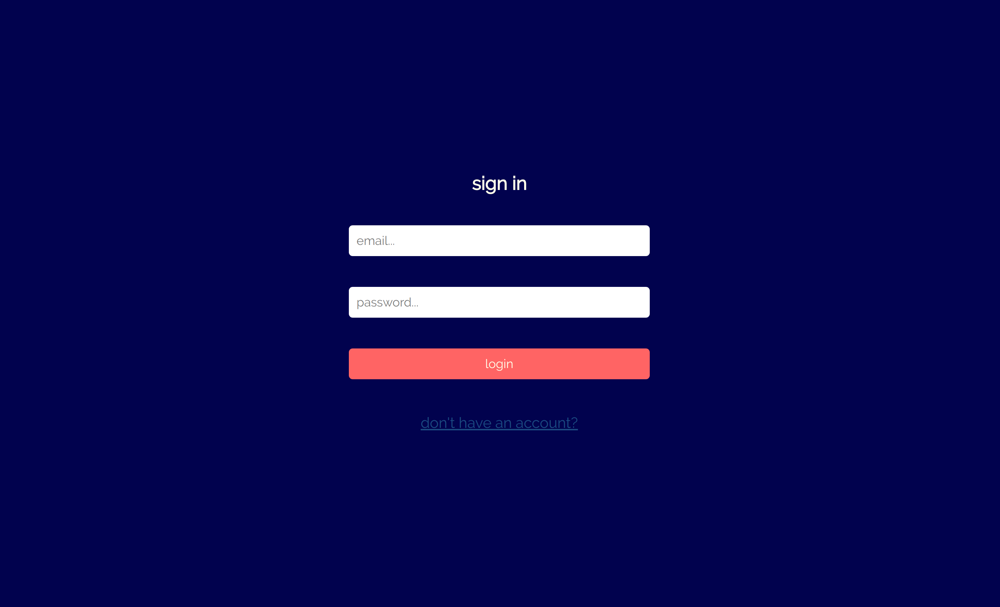

# ConcertMap

ConcertMap is a JavaScript, NodeJS, PostgreSQL, CSS, and HTML web application that provides users an easy way to plan out a spontaneous night out with friends. Upon entry, users will see a collection of concerts playing in their local area tonight. This information is presented using Google Maps, and Markers to indicate where they are held, as well as a list informing users of the concert name and date. 

Users are able to select a concert, add concerts, and create 'trips'. 

Selecting a concert will present artists playing at the concert, with a playlist of their music obtained from Spotify. This makes it easier for users to decide on which concert as they are able to sample artists before signing up. 

Custom concerts can be added if the user is aware of a local concert that is not made public. These custom concerts will be shown to all other users. 

Finally, a user is able to create a 'trip', which is a collection of concert's they've attended in the past. It gives users an opportunity to share their musical journey with others. 

All of this is done through the combination of Songkick, Spotify, and Google Maps APIs.

## App Views
<h3 align='center'>Map View of all Concerts in City</h3>

<h3 align='center'>Spotify Popup with Artist Playlist</h3>

<h3 align='center'>Account View</h3>

<h3 align='center'>Sign In Page</h3>

## Setup

1. Fork this repository
2. Clone the repository
3. Remove the git remote: `git remote rm origin`
4. Add a remote for your origin: `git remote add origin <your github repo URL>`
5. Push to the new origin: `git push -u origin master`
6. Set up database in -psql
7. Build tables using `db/schema/`
7.1. (Optional) Seed table data with `db/seeds`
8. Set up .env variables directing to proper locations for database
9. Run program using `npm start`

## Notes
- Currently there are several bugs, and features that have not been fully implemented
  - For example, user login is set to a single user account
-  Users need to provide app with Spotify authentication for app to function

## Dependencies

- Node 10.x or above
- NPM 5.x or above
- PG 6.x
- bcrypt 2.0.0
- body-parser 1.19.0
- chalk 2.4.2
- cookie-session 1.3.3
- dotenv 2.0.0
- ejs 2.6.2
- express 4.17.1
- geolib 3.0.4
- morgan 1.9.1
- node-sass-middleware 0.11.0
- pg-native 3.0.0
- request-promise-native 1.0.7
